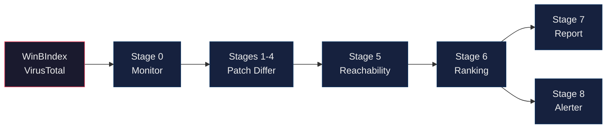

# AutoPiff

**Automated Patch Intelligence and Finding Framework**

A semantic analysis engine for detecting vulnerability fixes in Windows kernel driver patches. AutoPiff uses conservative YAML rules to identify security-relevant code changes with high precision and explainability.

## Overview

AutoPiff analyzes the differences between vulnerable and patched driver versions to automatically detect:

- **Use-After-Free fixes** (null assignments after `ExFreePool`)
- **Bounds check additions** (length validation before `memcpy`)
- **User/kernel boundary hardening** (`ProbeForRead`/`ProbeForWrite`)
- **Integer overflow protections** (safe math helpers)
- **State hardening** (interlocked refcounting)
- **IOCTL input validation**, **pool corruption guards**, **privilege checks**, and more

### Key Features

- **High Precision**: Conservative rules minimize false positives
- **Explainable**: Every finding includes rationale and evidence
- **Sink-Aware**: Rules consider proximity to dangerous APIs
- **Scoring Model**: Ranks findings by exploitability and reachability
- **Karton Integration**: Runs as a distributed service in malware analysis pipelines

## Why AutoPiff?

### Needle in a Haystack

```
Vendor releases 500 driver updates/year
├── 490 are feature/performance/cosmetic changes
├── 8 are minor bug fixes
└── 2 are silent security fixes (no CVE assigned)

Without automation: Manually review 500 to find 2
With AutoPiff:      Review 10 high-scorers to find 2
```

Security patches are often released without CVE assignments. Manually reverse engineering every driver update to find the security-relevant ones is not feasible. AutoPiff solves this by automatically surfacing the changes that matter.

### What AutoPiff Automates

| Phase | Manual Effort | With AutoPiff | Time Saved |
|-------|---------------|---------------|------------|
| Version pairing | 5-15 min/driver | Automatic | ~100% |
| Decompilation | 2-10 min/binary | Batched, parallel | ~95% |
| Function matching | 30-60 min/pair | Instant | ~100% |
| Identifying security changes | 2-8 hours/pair | Seconds | ~99% |
| Initial triage & ranking | 1-2 hours | Instant | ~100% |
| Report generation | 30-60 min | Instant | ~100% |

**Total: 4-12 hours per driver pair down to 2-5 minutes**

### What Still Requires Human Expertise

```
┌─────────────────────────────────────────────────────────────────┐
│  AUTOMATED by AutoPiff                                          │
│  ├── Find the needle: "This function changed near ExFreePool"   │
│  ├── Classify: "Looks like a use-after-free fix"                │
│  └── Rank: "Score 5.5 - worth investigating"                    │
├─────────────────────────────────────────────────────────────────┤
│  STILL MANUAL (Your expertise)                                  │
│  ├── Confirm exploitability: "Can I actually trigger this?"     │
│  ├── Root cause analysis: "Why was this vulnerable?"            │
│  ├── Exploit development: "How do I reach this sink?"           │
│  └── Impact assessment: "What's the real-world risk?"           │
└─────────────────────────────────────────────────────────────────┘
```

AutoPiff doesn't replace exploitation research. It makes it **feasible at scale** by automating the reconnaissance phase.

### Use Cases

**1. Silent Patch Detection**
- Monitor drivers for security fixes released without CVEs
- Get alerts when high-scoring semantic deltas appear
- Catch vulnerabilities before they're publicly disclosed

**2. 1-Day Vulnerability Research**
- When a CVE is announced, quickly identify the exact patch
- Correlate patch patterns with vulnerability classes
- Accelerate exploit development timelines

**3. Vendor Security Auditing**
- Analyze all versions of a driver family over time
- Generate timelines showing when fixes appeared
- Identify patterns in how vendors address vulnerabilities

**4. Historical CVE Corpus Building**
- Process known CVE driver pairs to build training data
- Validate and improve detection rules
- Create a knowledge base of patch signatures

## Architecture

AutoPiff runs as an 8-stage Karton pipeline. Each stage is an independent microservice communicating through Redis/RabbitMQ.



| Stage | Service | What it does |
|-------|---------|-------------|
| 0 | [`driver-monitor`](services/driver-monitor/) | Polls WinBIndex and VirusTotal for new driver versions, uploads to MWDB |
| 1-4 | [`karton-patch-differ`](services/karton-patch-differ/) | Version pairing, Ghidra decompilation, function matching, semantic rule evaluation |
| 5 | [`karton-reachability`](services/karton-reachability/) | Ghidra call-graph BFS from IOCTL/IRP entry points to changed functions, full decompilation export |
| 6 | [`karton-ranking`](services/karton-ranking/) | Scores findings using reachability, semantic severity, and attack surface |
| 7 | [`karton-report`](services/karton-report/) | Generates structured markdown reports, uploads to MWDB |
| 8 | [`autopiff-alerter`](services/autopiff-alerter/) | Sends Telegram alerts for findings scoring >= 8.0 |

## Semantic Rules

AutoPiff includes 58 rules across 22 categories. See [`Docs/semantic_rules.md`](Docs/semantic_rules.md) for the full specification and [`Docs/SEMANTIC_RULES_REFERENCE.md`](Docs/SEMANTIC_RULES_REFERENCE.md) for the technical reference.

| Category | Example Detection |
|----------|-------------------|
| `bounds_check` | Added length check before memcpy |
| `lifetime_fix` | Null assignment after ExFreePool |
| `user_boundary_check` | Added ProbeForRead/ProbeForWrite |
| `int_overflow` | Safe math helper usage |
| `state_hardening` | Interlocked refcount operations |
| `ioctl_input_validation` | New size/type checks in dispatch handlers |
| `pool_type_hardening` | Migration to NonPagedPoolNx |
| `privilege_check` | Added SeSinglePrivilegeCheck |

### Sink Groups

The rule engine tracks 50+ dangerous API symbols across 8 sink groups:

- `memory_copy`: RtlCopyMemory, memcpy, memmove
- `pool_alloc`: ExAllocatePool, ExAllocatePoolWithTag
- `pool_free`: ExFreePool, ExFreePoolWithTag
- `user_probe`: ProbeForRead, ProbeForWrite
- `io_sanitization`: RtlULongAdd, RtlSizeTMult
- `exceptions`: __try, __except
- `string_copy`: strcpy, wcsncpy
- `refcounting`: InterlockedIncrement/Decrement

## Scoring Model

Findings are scored using a configurable model ([`rules/scoring.yaml`](rules/scoring.yaml)):

```
final_score = semantic_score + reachability_bonus + sink_bonus - penalties
```

**Score Components:**
- **Semantic Score**: Rule weight x confidence x category multiplier
- **Reachability Bonus**: IOCTL (+4.0), IRP (+2.5), PnP (+2.0), Internal (+0.5)
- **Sink Bonus**: memory_copy (+1.5), user_probe (+1.5), pool_alloc (+1.2)
- **Penalties**: Low matching quality, high noise risk

**Gating:**
- Findings with confidence < 0.45 are dropped
- Matching confidence < 0.40 caps score at 3.0

## Installation

### As Karton Service (Recommended)

```bash
git clone https://github.com/splintersfury/AutoPiff.git
cd AutoPiff
docker compose up -d
```

For the full production stack with MWDB, dashboards, and monitoring, see [driver_analyzer](https://github.com/splintersfury/driver_analyzer).

### Standalone Library

```bash
pip install pyyaml

from services.karton_patch_differ.rule_engine import SemanticRuleEngine

engine = SemanticRuleEngine('rules/semantic_rules.yaml', 'rules/sinks.yaml')
hits = engine.evaluate(func_name, old_code, new_code, diff_lines)
```

## Configuration

### Environment Variables

| Variable | Description | Default |
|----------|-------------|---------|
| `MWDB_API_URL` | MWDB Core API endpoint | `http://mwdb-core:8080/api/` |
| `MWDB_API_KEY` | MWDB API key for uploads | (required) |
| `KARTON_REDIS_HOST` | Redis host for Karton | `karton-redis` |
| `AUTOPIFF_GHIDRA_TIMEOUT` | Ghidra decompilation timeout (sec) | `900` |
| `VT_API_KEY` | VirusTotal API key for driver monitoring | (optional) |
| `TELEGRAM_BOT_TOKEN` | Telegram bot token for alerts | (optional) |
| `TELEGRAM_CHAT_ID` | Telegram chat for alerts | (optional) |
| `AUTOPIFF_SCORE_THRESHOLD` | Minimum score for Telegram alerts | `8.0` |

### Rule Customization

Edit [`rules/semantic_rules.yaml`](rules/semantic_rules.yaml) to add or modify rules:

```yaml
rules:
  - rule_id: my_custom_rule
    category: bounds_check
    confidence: 0.85
    required_signals:
      - sink_group: memory_copy
      - change_type: guard_added
      - guard_kind: length_check
    plain_english_summary: Added length validation before memory copy.
```

## Output Format

AutoPiff produces JSON reports attached to MWDB samples:

```json
{
  "pairing": {
    "driver_new": {"sha256": "...", "version": "2.0.9.0"},
    "driver_old": {"sha256": "...", "version": "2.0.8.0"},
    "decision": "accept",
    "confidence": 0.95
  },
  "semantic_deltas": {
    "deltas": [
      {
        "function": "HandleIoctl",
        "rule_id": "null_after_free_added",
        "category": "lifetime_fix",
        "confidence": 0.88,
        "sinks": ["pool_free"],
        "final_score": 5.5,
        "why_matters": "Pointer is now set to NULL after freeing memory."
      }
    ],
    "summary": {
      "total_deltas": 1,
      "top_score": 5.5,
      "match_rate": 100.0
    }
  }
}
```

## Documentation

| Document | Description |
|----------|-------------|
| [`Docs/semantic_rules.md`](Docs/semantic_rules.md) | Semantic rule specification: how rules are structured and what each category detects |
| [`Docs/SEMANTIC_RULES_REFERENCE.md`](Docs/SEMANTIC_RULES_REFERENCE.md) | Technical reference for the rule engine, evaluation logic, and scoring |
| [`Docs/reachability.md`](Docs/reachability.md) | Reachability tagging spec: call-graph BFS from dispatch entry points |
| [`Docs/reporting.md`](Docs/reporting.md) | Report output specification and format |
| [`Docs/decisions.md`](Docs/decisions.md) | Design decisions and rationale log |
| [`rules/semantic_rules.yaml`](rules/semantic_rules.yaml) | All 58 detection rules (YAML) |
| [`rules/sinks.yaml`](rules/sinks.yaml) | 50+ dangerous API symbols grouped by category |
| [`rules/scoring.yaml`](rules/scoring.yaml) | Scoring model configuration |
| [`schemas/`](schemas/) | JSON schemas for every pipeline stage output |

## Project Structure

```
AutoPiff/
├── Docs/                          # Design docs and specifications
├── ghidra/scripts/                # Ghidra headless scripts
│   └── autopiff_reachability.py   # Reachability BFS + decompilation export
├── rules/
│   ├── semantic_rules.yaml        # 58 detection rules
│   ├── sinks.yaml                 # 50+ dangerous API symbols
│   └── scoring.yaml               # Scoring model configuration
├── schemas/                       # JSON schemas for each stage
├── services/
│   ├── karton-patch-differ/       # Stages 1-4: diffing + semantic analysis
│   ├── karton-reachability/       # Stage 5: call-graph + decompilation
│   ├── karton-ranking/            # Stage 6: scoring
│   ├── karton-report/             # Stage 7: report generation
│   ├── autopiff-alerter/          # Stage 8: Telegram alerts
│   ├── driver-monitor/            # Stage 0: version polling
│   └── dashboard/                 # Web UI
├── tests/unit/                    # 127 unit tests
├── docker-compose.yml
└── README.md
```

## Integration with driver_analyzer

AutoPiff is designed to work with [driver_analyzer](https://github.com/splintersfury/driver_analyzer), which provides the full production infrastructure (MWDB, Karton, MinIO, dashboards). The driver_analyzer compose file builds AutoPiff services directly:

```yaml
# In driver_analyzer/docker-compose.yml
karton-driver-patch-differ:
  build:
    context: ../AutoPiff
    dockerfile: services/karton-patch-differ/Dockerfile
  volumes:
    - ../AutoPiff/rules:/app/rules:ro
```

See the [driver_analyzer README](https://github.com/splintersfury/driver_analyzer) for setup instructions.

## License

MIT License - See [LICENSE](LICENSE) for details.

## Acknowledgments

- [Karton](https://github.com/CERT-Polska/karton) - Distributed malware processing framework
- [MWDB Core](https://github.com/CERT-Polska/mwdb-core) - Malware repository
- [Ghidra](https://ghidra-sre.org/) - NSA's software reverse engineering framework
